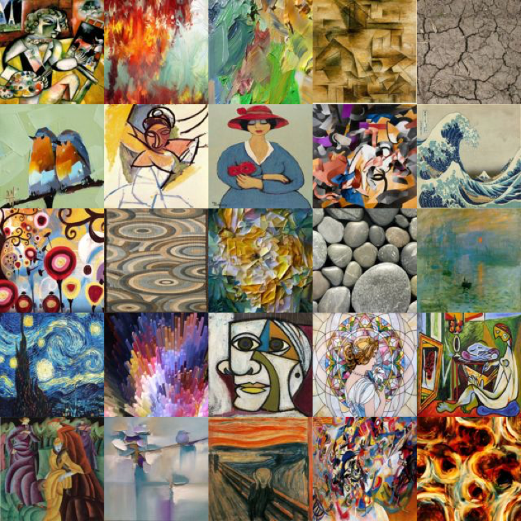
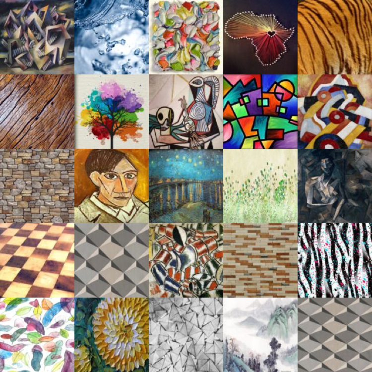

# quantative_style

This is the demo code repository for the WACV 2020 paper "Improving style tranfer with calibrated metrics"

https://arxiv.org/pdf/1910.09447.pdf


## Requirements
- Matlab R2015a for Ubuntu 14.04 
- Python 3
- PyTorch 0.2.0
- torchvision 0.2.0
- R (for calibrating base EC statistics)

## Style and Content Images
### Style Images
50 style images presented in the paper are collected from previous work and online sources. 
Download from the [link](https://www.dropbox.com/s/v6mrsdo12s459nm/50styles.zip?dl=0])



See 50 styles from the following links:

[50styles_1.pdf](https://github.com/stringtron/quantative_style/files/4075093/50styles_1.pdf) 
[50styles_2.pdf](https://github.com/stringtron/quantative_style/files/4075094/50styles_2.pdf)


### Content Images 
We use 200 test images and their ground truth contour annotations from the [BSDS500 dataset](https://www2.eecs.berkeley.edu/Research/Projects/CS/vision/grouping/resources.html).
Download all test content images, annotations, and examples of evaluated style transferred images used in the paper: 

https://www.dropbox.com/s/nflmpwisbpr1ebw/BSDS500.zip?dl=0

Unzip downloaded file as "./BSDS500" under the home directory of this repo. 

## Experiment procedure
For each configuration of one style transfer method, we randomly sample 300 combination of "style loss weight"-"content ID" -"style ID" and generate their corresponding style transfer images. These images are used for the following quantitative evaluation of style transfer methods.

### Base C statistics 
We use an off-the-shelf contour detection method by Arbelaezet al. [1],which estimates the probabiliy of boundaries (Pb) given an image.

The following example evaluate images generated from Universal Style transfer method: 
1. open Matlab and change directory to `./wacv2020testscript`
2. run `evaluation_streamline.m`, this will generate Pb maps and evaluation results from 300 style transfer images generated with Universal Style Transfer.
3. retreive evaluation results from `./BSDS500/ucm2/SampleTests/Universal` folder.

Breakdown Pb evaluation results for base C statistics:
1. Each folder in `./BSDS500/ucm2/SampleTests` represents evaluations on a set style transfer images generated by one configuration of a style transfer method.
2. Take Universal Style Transfer for example,
  - `PbRsts` stores every style transfer images' Pb detection result as a `.mat` file.
  - `round1_eval` stores Pb precision recall curves for evaluated images, see column names in this [function](https://github.com/stringtron/quantative_style/blob/master/bench/benchmarks/evaluation_bdry_image.m) for details.
  - `round1_eval_sum` summarizes Pb evaluation results by style loss weights, `all` folder includes all 300 images.
      - `eval_bdry.txt`,`eval_bdry_img.txt`, `eval_bdry_thr.txt` stores intermediate results.
      - `Universal_everyImgAUC.mat` stores base C statistics for all evaluated style transfer images. Each row shows weight, content id, style id, and the base C statistics for one image. Note this repo reports Pb precision-recall curve AUC as the base C statistics, the max F-1 score, which is the final reported score in our paper, can also be generated using this codebase, see this [function](https://github.com/stringtron/quantative_style/blob/master/bench/benchmarks/collect_eval_bdry.m) for details. 


### Base E statistics

We calculate the minus log KL distance between feature statistics of symthesized image and style image. For the evaluation of KL distance, We also use the PCA to reduce the rank of feature maps. See our paper for the details. 
The KL formula is based on Multivariate normal distributions of https://en.wikipedia.org/wiki/Kullback–Leibler_divergence
To generate the E statistics of smaple images, please run the E_base.ipynb step by step 
```
python E_base.ipynb
```
The related files and folders for E_base.ipynb:
1. the style images are in style_dir = `./50styles`
2. the reference images( or content images) for PCA basis are in Reference_dir = `./content/`
3. the sample(or synthesized) images are in source_dir = `./sample/` and are listed in `sample.txt`
4. the generate E values of 5 layers of each sample are listed in `EValue[32, 48, 128, 256, 256].txt`
5. the pre-trained VGG model is saved at model_dir = `./Models/` .  The model can be downloaded from https://www.dropbox.com/s/xc78chba9ffs82a/vgg_conv.pth?dl=0


### Calibrating E statistic and Calibrating C statistic

## In section 4.1 of our paper, the admissible models for calibrating E statistic and calibrating C statistic are:

## E: 0.7468*E1+0.2557*E2+2.3768*E3

## C: 12.1835*C+0.2979 *E1
#### TODO: upload calibration code


References
[1]  P.  Arbelaez,  M.  Maire,  C.  Fowlkes,  and  J.  Malik. Con-tour detection and hierarchical image segmentation.IEEEtransactions  on  pattern  analysis  and  machine  intelligence,33(5):898–916, 2011.

## Citation
Please cite our paper for any purpose of usage.
```
@article{yeh2019improving,
  title={Improving Style Transfer with Calibrated Metrics},
  author={Yeh, Mao-Chuang and Tang, Shuai and Bhattad, Anand and Zou, Chuhang and Forsyth, David},
  journal={arXiv preprint arXiv:1910.09447},
  year={2019}
}
```
